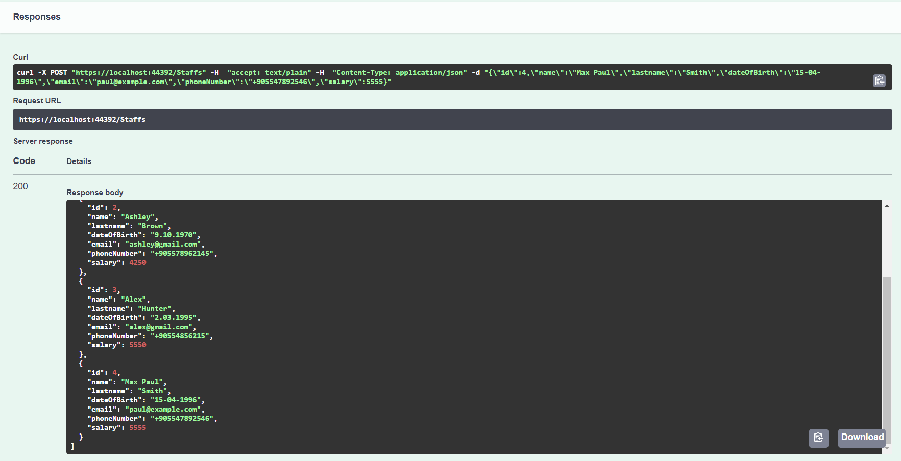
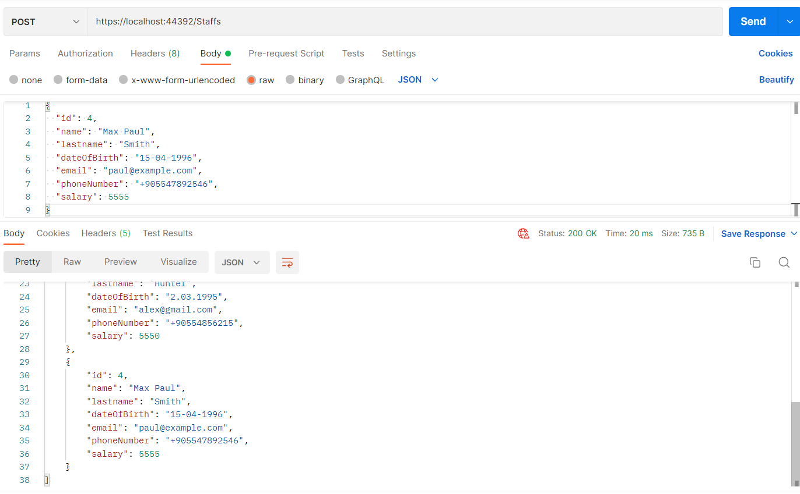
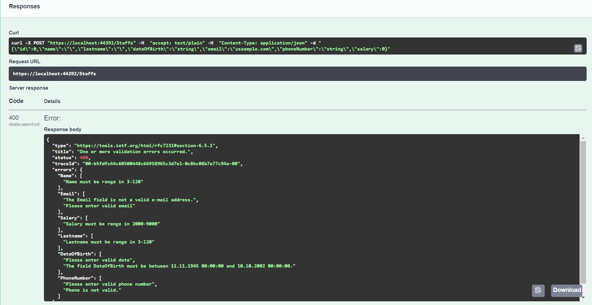
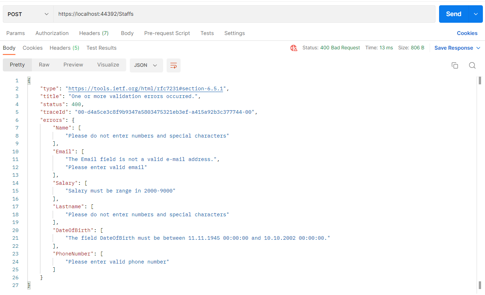

# Validation in .NET
Bu projede .NET'de özel validasyonlar yapılarak Http Get, GetById, Post, Put ve Delete methodları yazılmıştır.
Validasyonları Staff.cs , methodları StaffController.cs dosyalarında görebilirsiniz.

## Installation
Öncelikle projeyi kolonlayın.

```
git clone https://github.com/195-Patika-Dev-Paycore-Net-Bootcamp/assignment-2-sinemyoruc.git
```

## Usage
Projeyi cloneladıktan sonra Visual Studio 2022 programında açınız.

Daha sonra uygulamayı çalıştırabilirsiniz.


## Outputs

### Successful



### Errors


